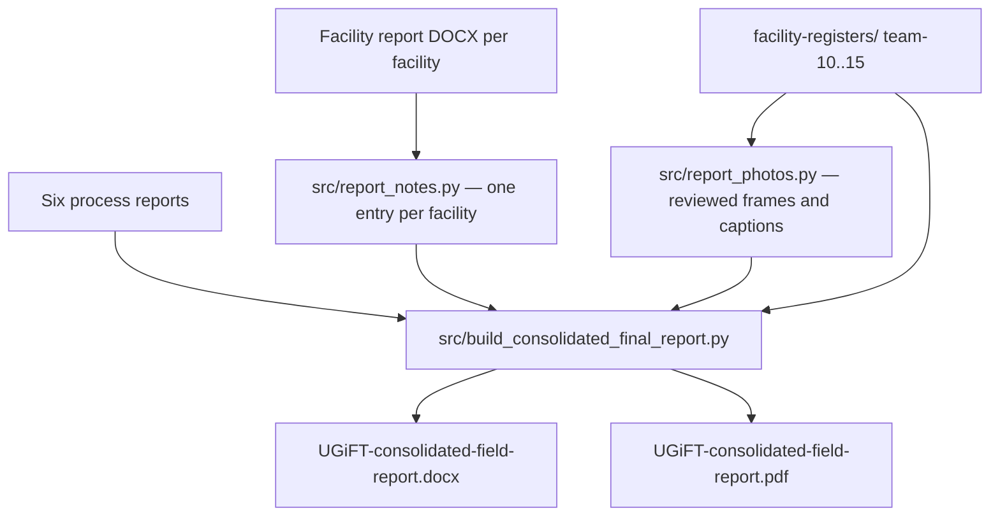

# Consolidated UgIFT field report — plan

## What this document is

One report for all four sub-regions, written to the programme's **process report
template** (`source-documents/Process report template.docx`) and used for
decisions. The template asks for four things, and they are the spine:

1. Introduction — a brief on the assignment
2. Process / methodology — what was done and how, the **team members** and the
   **local governments verified**
3. Emerging issues and challenges
4. Recommendations

The field evidence sits between the methodology and the issues, because the
issues are drawn from it and a reader should meet the evidence before the
conclusion built on it.

## Locked decisions

- **One document**, Word and PDF, both written by the same run.
- **Structure:** Cover → Contents → 1 Introduction → 2 Process and methodology
  → 3 Coverage → 4 Findings by local government → 5 Emerging issues and
  challenges → 6 Recommendations → 7 Submission.
- **The plates are samples, and the report says so.** Section 2.3 states how
  many photographs are on file across the facilities, how many are reproduced,
  and how the reproduced ones were chosen; section 3 gives how many facilities
  carry a plate and how many do not. Both figures are counted at build time
  from the register tree, so neither can drift. The set the plates are drawn
  from is described as held with the verification records; no path is named.
- **Ordered by region and local government, not by team.** Districts and
  municipal councils are separate chapters (`Tororo Municipal Council` is not
  folded into `Tororo District`).
- **Teams are named**, because the template asks for them: a roster table in
  2.4 gives each team, its members and the local governments it verified, and
  every local government chapter carries a one-line attribution. The roster's
  local governments are read from the chapter spine, so the two cannot drift.
- **Per facility:** a short entry — what stands on the site, the state of the
  supplied assets, what is outstanding — and **as many captioned photographs
  as the gallery and the page will carry, to a ceiling of ten**. How many is
  decided by the evidence, not by a quota: a facility whose gallery carries
  the whole story is given eight or nine, one photographed twice is given two.
- **Counts are figures, not words.** `67 of the 76 register lines`, not
  `Sixty-seven of the seventy-six`. The exception is `one`, which in English is
  as often an article as a count (`the one facility`, `not one carton was
  opened`), and adjectives that are not counts (`a three-digit number`,
  `senior-one learners`). No sentence opens on a digit.
- **Nothing the reader already knows.** No explanation of what the programme
  is, no description of the sub-regions, no recitation of the facility lists,
  no "section 3 sets out…" roadmap, and nothing said twice: a figure that a
  table carries is not repeated in prose beside it.
- **Plain, short, and specific.** Every claim in sections 5 and 6 names the
  facilities behind it.

## Writing rules

- Say what the visits established. Where a visit did not settle something, give
  the reason against the facility rather than filling the gap from paper.
- Supplied and found are never merged (`facility-registers/RULES.md` §1).
- Counts and figures quoted in the text are derived at build time where they
  can be, so the prose cannot drift from the evidence. The designation
  mismatch in section 5 — health centres listed at level II and found at level
  III — is counted from the facility reports on every run.

## Layout rules

| Rule | Why |
|---|---|
| Running prose is **justified**; headings, labels, captions and bullets are not | Justified body reads as a formal report; justifying short lines stretches them |
| Photographs are shown **whole — never cropped** | A cropped frame is no longer the evidence that was taken: a signboard loses its district line, a ward loses the bed at its edge |
| Photographs are laid out as **full-width lines**: the frames on a line are scaled to one common height chosen so the line fills the text column exactly | Every line runs margin to margin, so no plate leaves a white gutter down one side, and a tall frame no longer wastes the space a fixed width forces beside it |
| Lines are broken for the **whole plate at once**, by the dynamic programme a typesetter uses to break a paragraph into lines | A bad line is never forced onto a later one, and a facility's frames read as one set rather than as pictures that happen to sit together |
| A line stands between 1.42 in and 2.50 in high, carries at most four frames, and drops no frame below 0.78 in wide | Below those a frame stops being evidence; a panorama beside a portrait would otherwise squeeze the portrait to a sliver |
| A line is never drawn taller than the height that fills the column exactly | Frames keep their proportions, so extra height is extra width: a line drawn taller is a line that runs into the margin |
| The chosen order is kept where it lays out well, and regrouped only where keeping it would leave a line short or a frame overbearing | The order is the order the frames were chosen in — the site, then what is in it, then what is wrong with it — and the caption travels with its frame |
| Captions are written to fit the frame above them, three lines at most | A caption sits in a column no wider than its own frame, and a five-line caption under a narrow frame pulls the line apart |
| A photo line is one table row with `cantSplit` | A photograph never breaks across two pages, and never leaves its caption behind |
| Captions sit **directly beneath** the image, 1 pt above, 0 below | No floating gap between a picture and what it says |
| Headings, entries and their photographs `keep_with_next` | A facility is not split from its evidence |
| Table header rows repeat, data rows do not split | A table running over a page is still readable |

## Build

```bash
python src/build_consolidated_final_report.py
```

One run produces both deliverables from the same open document, so the PDF can
never be a stale copy of an older Word file:

- `final-UGiFT-report-karamojja-6-teams/UGiFT-consolidated-field-report.docx`
- `final-UGiFT-report-karamojja-6-teams/UGiFT-consolidated-field-report.pdf`

The build fails rather than producing a wrong document if the PDF is not
written, if a facility folder on disk is missing from the report or vice versa,
if a facility has no written entry, if a named photograph is missing, or if the
facility and photograph counts drift while composing.



## Modules

| File | Holds |
|---|---|
| `src/build_consolidated_final_report.py` | The chapter spine, the team roster, the section text, the layout rules and the build checks |
| `src/report_notes.py` | The entry for each of the 102 facilities, drawn from that facility's own report |
| `src/report_photos.py` | The photographs embedded, and what each one shows |
| `tmp/sheet.py`, `tmp/pick.py`, `tmp/plate.py` | The review tools: contact sheets, the entry beside them, and how a candidate set would lay out |

## Photograph selection

Selection is **visual**. Every facility's whole gallery was laid out as a
numbered contact sheet and reviewed frame by frame against that facility's own
written entry, because the frames have to evidence what the entry says — the
works, the supplied assets, and whatever is wrong with them — and not give a
general impression of a site. The caption states what is actually in the frame,
and every caption quoting an engraved mark was read off the image.

**How many** is decided by the gallery and by the page, not by a quota. A
facility whose gallery carries the whole story is given up to ten frames; one
photographed twice is given two. Frames are also chosen for their **shapes**,
since a line only fills the text column when the shapes on it add up to its
width: a tall frame is kept beside a wide one, and a sixth 16:9 frame is not
kept when it would leave a line short.

Three tools carry the work, and none of them decides anything:
`tmp/sheet.py` lays a gallery out as numbered contact sheets, `tmp/pick.py`
prints the facility's entry beside them, and `tmp/plate.py` shows how a
candidate set would break into lines and how much of the column each would
fill, so a set is checked before it reaches the report.

File names are not reliable evidence and were not trusted:

- Many frames are captioned only `uncaptioned-asset` (Nakwasi, Mazimasa,
  Muhula, Bubentsye), so nothing could be chosen by name at all.
- Some carry a caption belonging to another subject — a water-stained ceiling
  filed as `facility-signboard` at Bundege HC III, a table edge filed as a
  chair backrest at Nakatsi.
- Several folders hold frames belonging to a **neighbouring facility**: school
  furniture under Kwirwot HC III, health equipment under Malaba Seed School,
  Iyolwa desks under Sop Sop. Those are excluded.
- One folder held 490 working files (`_z_*` register crops) at Kapkoros HC III.

Excluded on sight: paperwork of every kind (toolkits, registers, delivery
notes, visitors' books), frames of people — staff, patients and learners are
not published — team vehicles, and unusable exposures. Frames stored upside
down are left out rather than turned, because the file is the evidence as it
was taken. After selection the set is checked for duplicate images, duplicate
captions within a facility, and blur or exposure outliers; frames that fail
are re-picked from the sheet.

## Coverage of the current build

- 25 local governments, 102 facilities: 53 seed secondary schools, 49 health
  centres.
- 5,397 photographs on file across the 102 facilities. 668 of them are
  reproduced, across 93 facilities, between one and ten each. The other 9
  carry no plate: 3 were photographed only in their hand-filled record and 6
  were not photographed at all, and each says which in place of its plate.
  Those 9 are a gap in the field return, not a selection: nothing of the site
  or its assets exists on file to reproduce.
- Three municipal councils on the allocation — Busia, Moroto and Kotido — have
  sent no return and so have no chapter. They are carried in the
  recommendations, where an owner and a date can be assigned to them.

## Quality checks before calling it done

- [x] Every facility folder with a return appears exactly once; schools before
      health centres in each local government; municipal councils separate
- [x] Every facility has a written entry; every named photograph exists
- [x] No image embedded twice, and no facility with two identical captions
- [x] All 668 photographs render whole, each on the same page as its caption,
      none crossing a page edge (checked against the built PDF)
- [x] Every line of frames fills the text column and none overruns the
      margin; the build names the facilities whose galleries hold too few
      frames to fill a line, and the captions that run past three lines
- [x] Figures quoted in the text agree with the register tree, including the
      photograph counts in 2.3 and 3
- [x] No count is spelled out as a word, and no sentence opens on a digit
- [x] No team number, member name or roster appears outside section 2.4 and the
      chapter attributions
- [x] Word and PDF written from the same run
